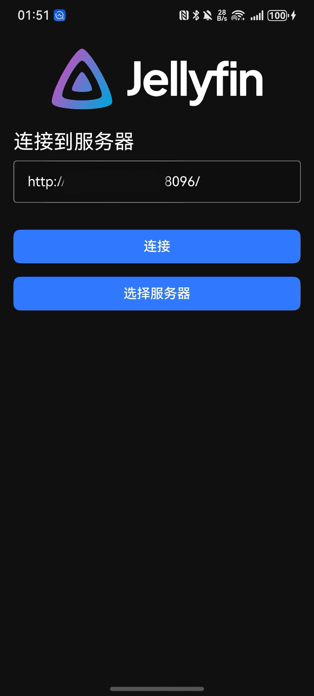
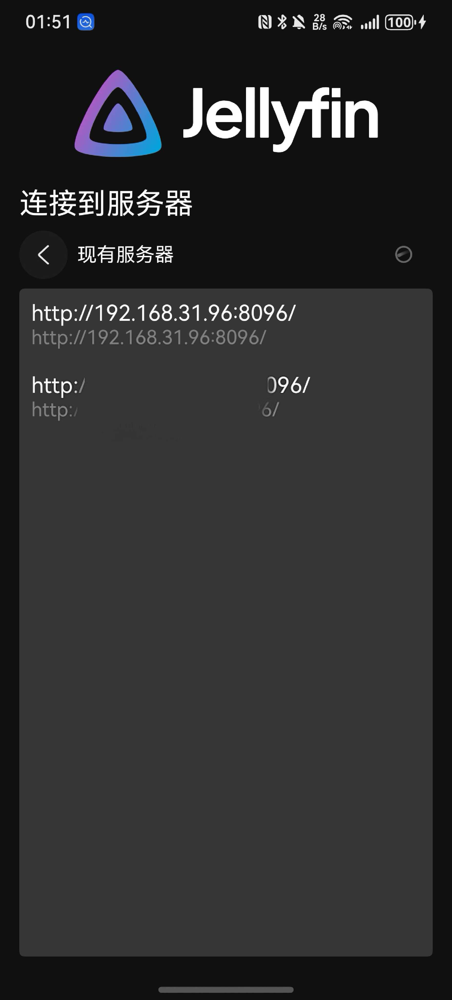
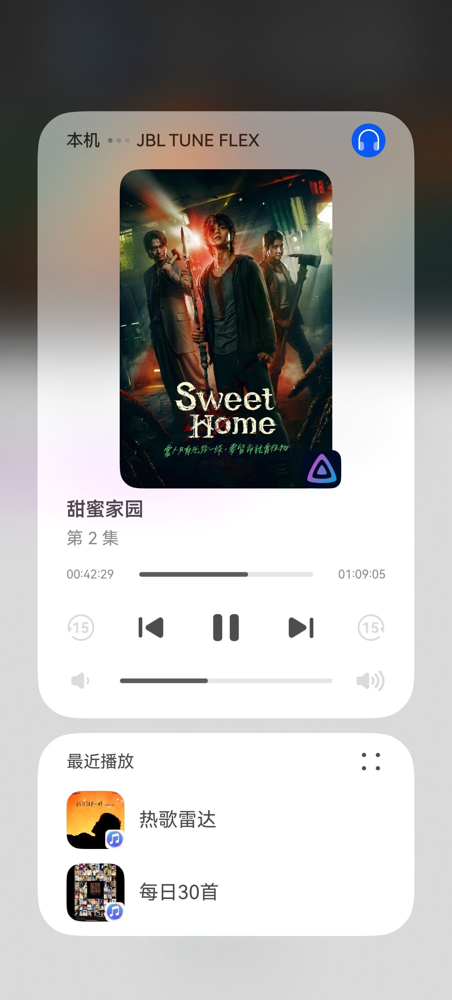

<h1 align="center">JellyFin HarmonyOS</h1>
<h3 align="center">Unofficial client of the <a href="https://jellyfin.org">Jellyfin Project</a></h3>

---

 
 

Jellyfin_HarmonyOS 是一款 HarmonyOS 应用，可连接到 Jellyfin 实例并与官方 Web 客户端集成。具体功能实现参考了安卓端开源代码

## 简单说两句
写这个东西是出于学习的目的,为了提高自己的鸿蒙开发能力,为了小众圈子能用上鸿蒙版的软件,也为了促进鸿蒙生态发展出一份力.

PS:闲暇时间写的,禁止催更!

## 进度
由于本人对项目不太了解,具体都有什么功能也说不准,并且没开发过音视频类,大概率会有很多bug

### 已完成

- 连接到服务器
- 切换服务器
- 发现本地设备
- 简单的播放
- 记录播放进度
- 支持ass/srt字幕
- 播放器控制(音量,亮度,进度)
- 倍速
- 播放默认选中的音轨/字幕
- 下一集
- 通知栏播放卡片(AVSession播控)
- 切换音轨
- 切换字幕

### 未完成/规划中

#### V1.0.0
- 投屏(AVCast)
- 全屏锁
- 切换清晰度
- 视频详情页(选集列表,简介,更多推荐...)
- 画中画

#### 待排期
- 下载
- 投屏
- 设置
- ...

🧬 效果图
------------

|                            连接到服务器                            |                              现有服务器                              |                              播控                               |
|:------------------------------------------------------------:|:---------------------------------------------------------------:|:-------------------------------------------------------------:|
|  |  |  |

## 代码相关

- 服务器相关操作,把Jellyfin的<a href="https://github.com/jellyfin/jellyfin-sdk-typescript">TypeScript SDK</a>进行鸿蒙化后使用
- 播放器经过尝试后采用<a href="https://ohpm.openharmony.cn/#/cn/detail/@ohos%2Fijkplayer">ijkPlayer</a>
- 播放控制页基于开源库<a href="https://gitee.com/openharmony-tpc/openharmony_tpc_samples/tree/master/GSYVideoPlayer">GSYVideoPlayer</a>修改
- 弹窗使用<a href="https://github.com/xdd666t/ohos_smart_dialog">ohos_smart_dialog</a>

感谢开源大佬们的无私奉献!